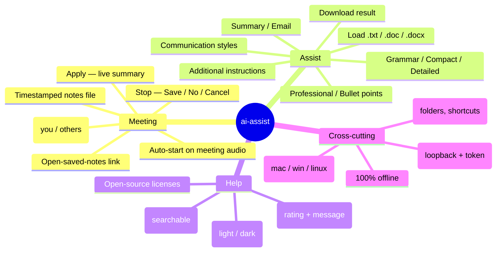
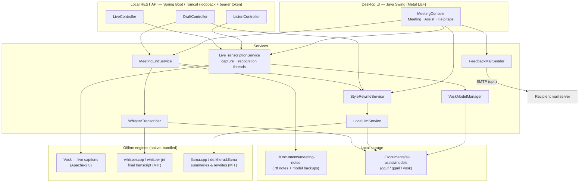
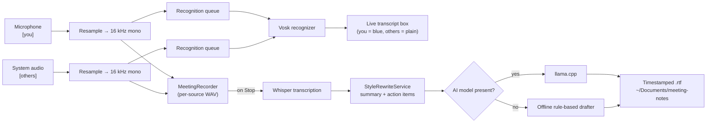
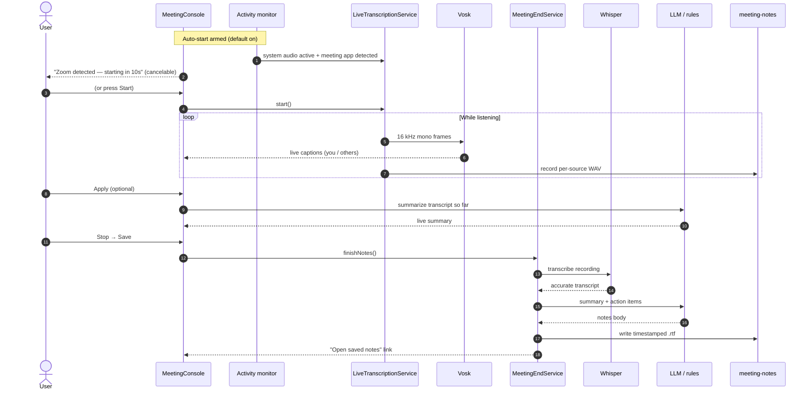
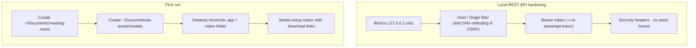

# ai-assist — Architecture

This document describes the architecture of **ai-assist**: features, the
technologies behind each part, the runtime data flow, and the meeting
sequence. The diagrams below are [Mermaid](https://mermaid.js.org/) and render
on GitHub. An **editable draw.io** version (component architecture + data flow)
is at [`ai-assist-architecture.drawio`](ai-assist-architecture.drawio) — open it
at [diagrams.net](https://app.diagrams.net/).

- Repository: <https://github.com/marutisridharjob/ai-assist>
- Everything runs **100% locally and offline** — no cloud, no account, nothing
  leaves the machine (the one exception is the optional feedback email).

---

## 1. Feature map

---

## 2. Component & technology architecture

**Technologies at a glance**

| Layer | Technology | Purpose | License |
|---|---|---|---|
| UI | Java 21 + Swing (Metal L&F) | Native desktop window, same on every OS | GPLv2+CE (OpenJDK) |
| App wiring / API | Spring Boot 3.5 + Tomcat | Dependency injection, optional local REST API | Apache-2.0 |
| Live captions | Vosk 0.3.45 | Real-time speech-to-text | Apache-2.0 |
| Final transcript | whisper.cpp via whisper-jni 1.7.1 | Accurate offline transcription on Stop | MIT |
| Summaries / rewrites | llama.cpp via de.kherud:llama 4.1.0 | In-process LLM (GGUF model) | MIT |
| Native access | JNA 5.7.0 | Java ↔ native bindings | Apache-2.0 / LGPL-2.1 |
| System audio | Core Audio tap (macOS) · WASAPI (Windows) · PulseAudio/PipeWire monitor (Linux) | Capture the other participants | OS APIs |
| Packaging | jpackage (JDK) | Native installers with a bundled runtime | GPLv2+CE |

---

## 3. Runtime data flow

Key design point: **audio capture and speech recognition run on separate
threads** connected by a bounded queue. If a heavy model can't keep up in real
time, the queue drops the oldest audio (keeping captions near-live) while the
**recording stays complete** — so the saved Whisper transcript is unaffected.

---

## 4. Meeting sequence

---

## 5. Security & first-run

See [`../packaging/README.md`](../packaging/README.md) for how the native
installers are built (and slimmed per-OS), and
[`TECHNICAL-DOCUMENTATION.md`](TECHNICAL-DOCUMENTATION.md) for the full write-up.
